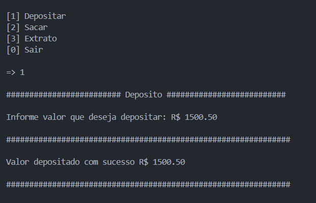

# Sistema Bancário Simples

Um sistema bancário desenvolvido em Python como projeto do BootCamp Santander + DIO, ensinando conceitos como controle de saldo, depósitos, saques e histórico de transações.

## Mentoria

Projeto criado durante a imersão em Python do BootCamp Santander + DIO, com supervisão de mentores e troca ativa com mais de 1.000 colegas em um contexto de aprendizado colaborativo.

## Tecnologias
 
- Python 3


- Visual Studio Code
## O que aprendi e apliquei

- **Controle de fluxo**: uso de `while`, `if / elif / else` para navegação no menu e validações.
- **Entrada de dados**: tratamento de `input()`, e conversão com `int()` e `float()`.
- **Manipulação de strings**: formatação com f-strings e registro histórico no extrato.
- **Lógica de transações financeiras**: operação de depósitos, saques (com limites), e gerenciamento de saldo.
- **Estrutura de dados**: para armazenar o histórico de transações.
- **Validações robustas**:
  - valores positivos;
  - manejo de entrada vazia e não numérica;
  - controle de limite diário de saques.
- **Boas práticas**: código organizado, mensagens claras ao usuário e estrutura modular (menu + funções).

## Funcionalidades

1. Depósito com suporte a centavos (aceita `50.60` e `50,60`)
2. Saque com:
   - limite por operação (`R$ 500`)
   - limite diário (até 3 saques)
   - verificação de saldo disponível
3. Extrato com histórico completo de transações individuais
4. Tratamento de entradas inválidas
5. Encerramento limpo do programa

## Como executar

```bash
git clone https://github.com/Vycttor/Sistema-Bancario-Simples.git

python app.py
````

## Exemplo de uso


## License

[MIT](https://choosealicense.com/licenses/mit/)
